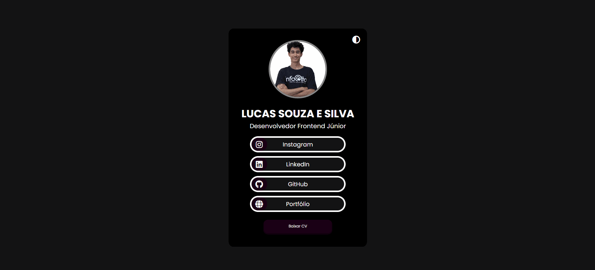

# Linktree Pessoal

## 📃Descrição
Olá turma, espero que todos estejam bem! Esse projeto é um pouco antigo, mas ainda funciona perfeitamente. Basicamente, desenvolvi um linktree totalmente personalizado usando HTML5, CSS3 e Javascript puros, sem nenhum framework. O diferencial desse projeto é que ele conta com um botão onde conseguimos mudar o tema. Nessa primeira versão, ele não possui armazenamento no navegador, ou seja, o tema não fica guardado quando se sai do navegador. O design é totalmente responsivo!

## 💻Tecnologias Utilizadas
- HTML5
- CSS3
- Javascript 

